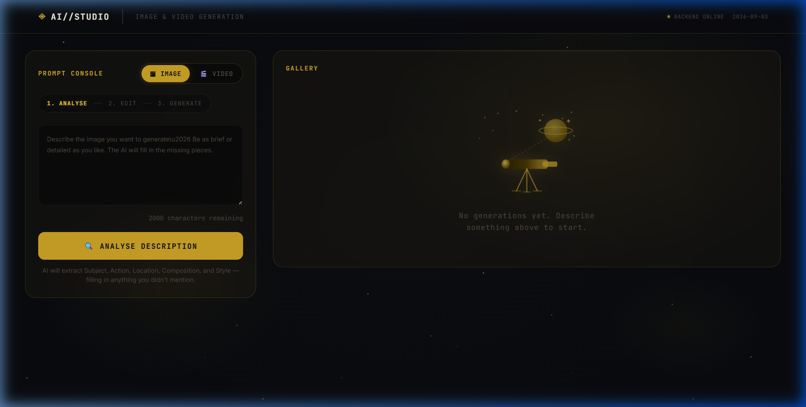
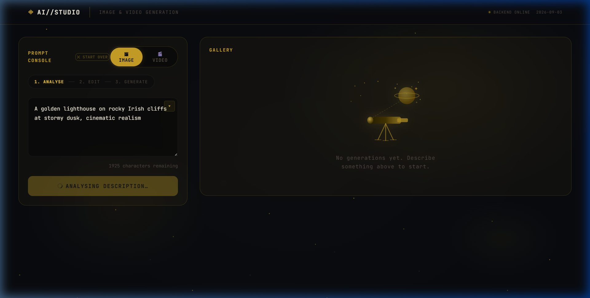
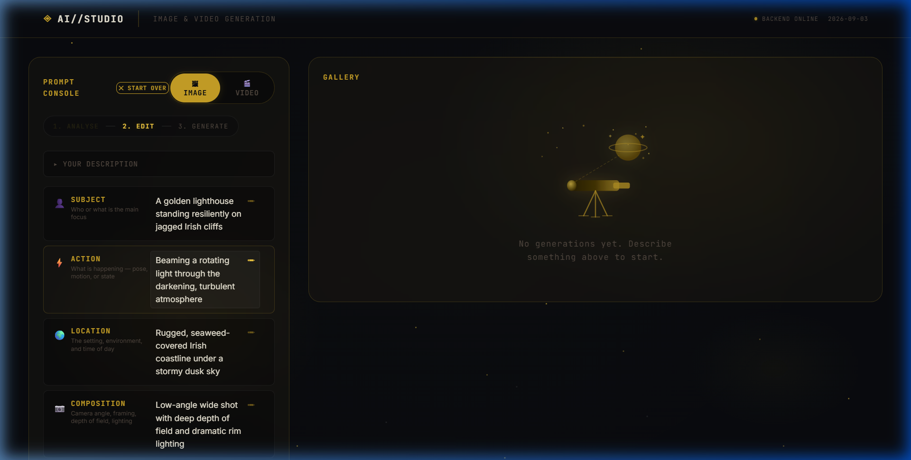
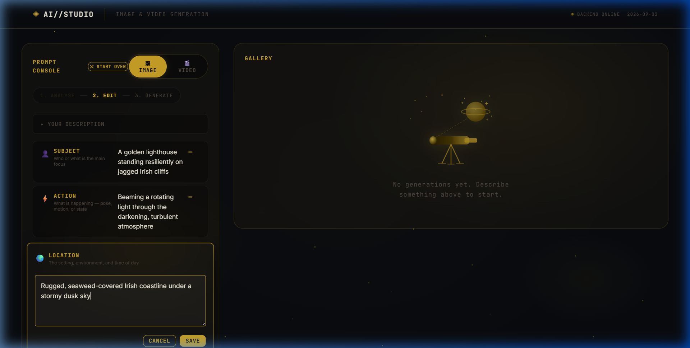
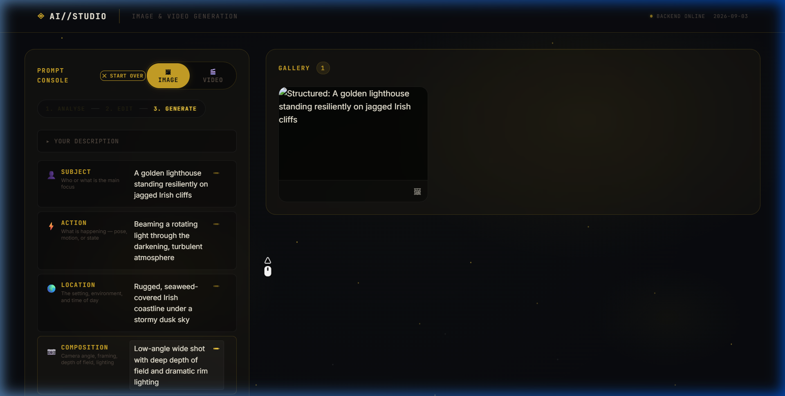
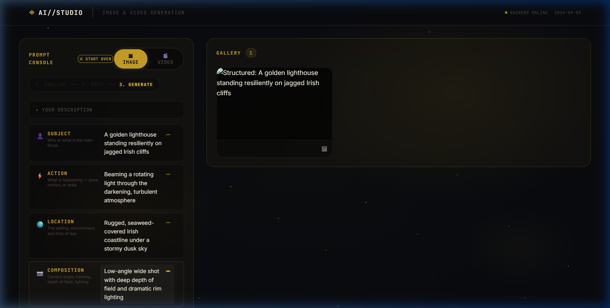
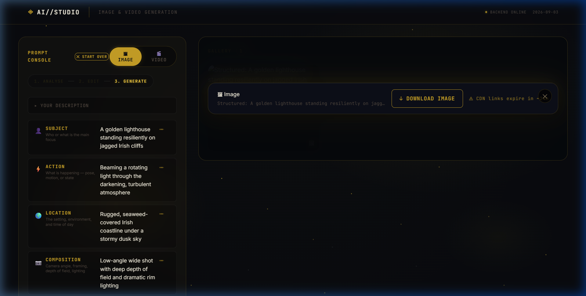
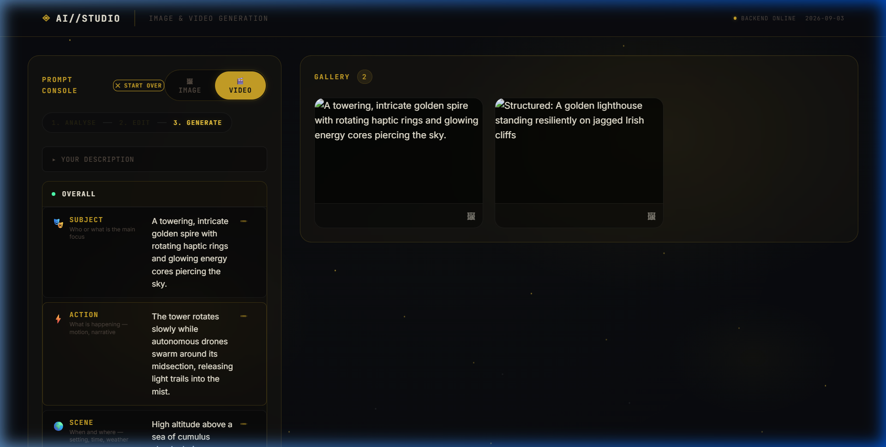
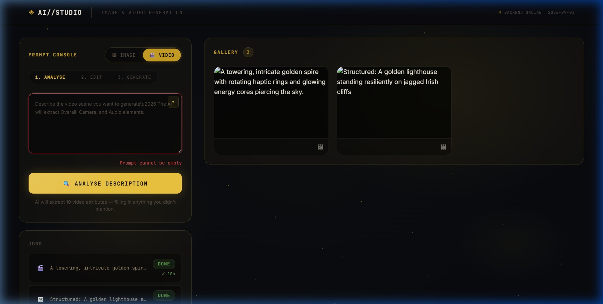

# Visual QA Report

The following UI states were captured during a live browser session recording of the AI-Studio application.

### State 1: Initial Empty State

### State 2: Analysing (Groq Call 1 in progress)

### State 3: Editing Attributes

### State 4: Generating (Cosmic Orbit Animation)

### State 5: Image Result

### State 6: Video Generation Result

### State 7: Error State

